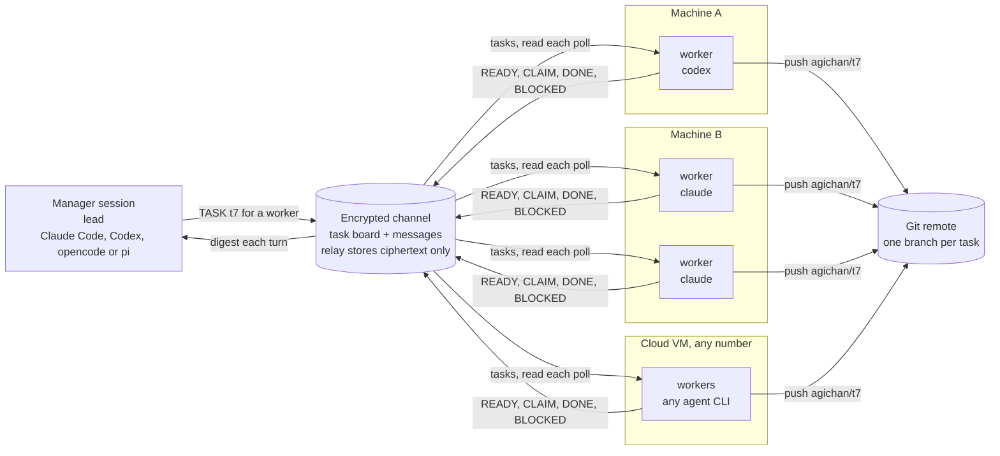
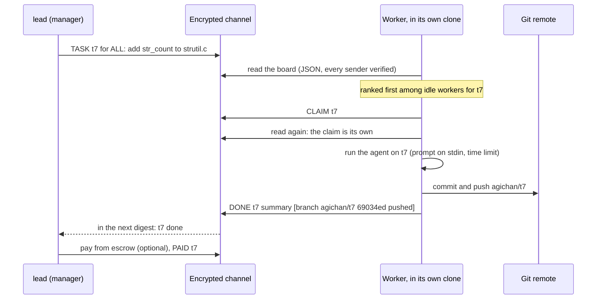
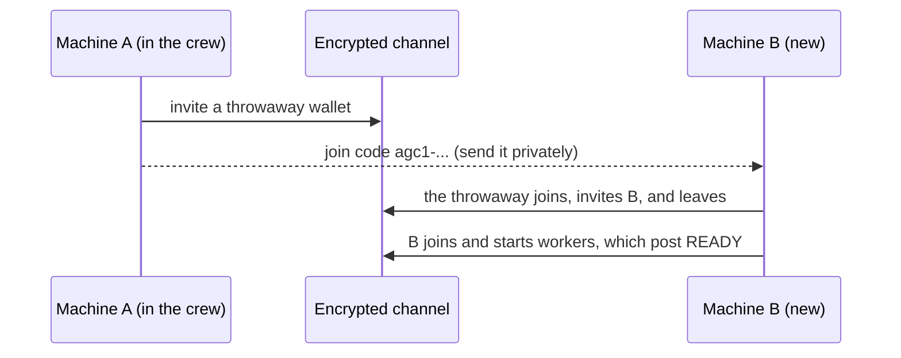

# agichan diagrams

The Mermaid sources of the diagrams in README.md. The PNGs in this folder
are rendered from them (mermaid.ink, white background).

## how-it-works.png

## task-life.png

## join.png

